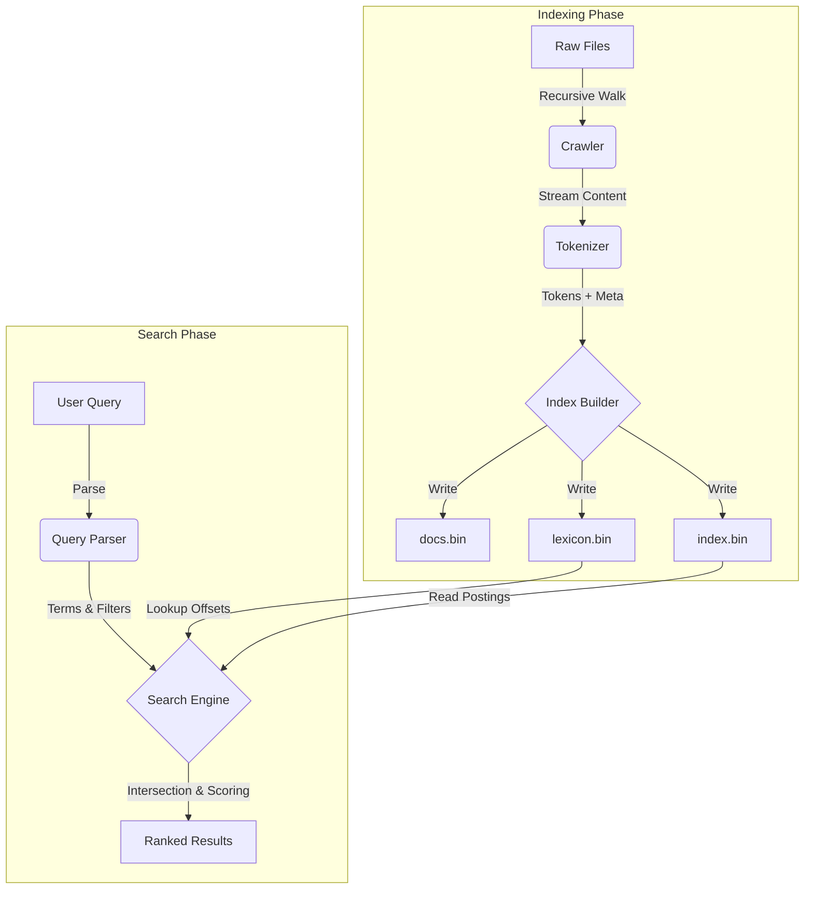

# DevScope: High-Performance Code & Log Search Engine

DevScope is a custom-built, high-performance search engine designed specifically for source code and application logs. Built from scratch in Go, it features a custom binary indexing format, efficient tokenization, and a powerful query engine supporting exact phrase matching and metadata filtering.

## 🚀 Features

*   **Custom Binary Index**: Optimized `.bin` format for minimal storage overhead and fast retrieval.
*   **Smart Tokenization**:
    *   **Source Code**: Extracts identifiers, function names, and structural elements.
    *   **Logs**: Parses timestamps (ISO-8601), log levels (ERROR/WARN), and messages.
*   **Advanced Inquiry**:
    *   **Phrase Search**: Exact sequence matching (e.g., `"fatal error"`).
    *   **Metadata Filters**: Filter by file extension (`ext:.go`) or log level (`level:ERROR`).
    *   **Implicit AND**: All terms in a query must match for precise results.
*   **Ranking Algorithm**: TF-IDF scoring with metadata boosting (bonuses for matches in filenames or function definitions).
*   **CLI Interface**: Simple, human-friendly command-line tools for indexing and searching.

## 🛠️ Architecture



DevScope operates in two main stages:

### 1. Indexing (`devscope index`)
*   **Crawler**: Recursively walks directories, identifying supported files (`.go`, `.py`, `.log`, etc.).
*   **Tokenizer**: Breaks text into tokens, capturing positions (for phrase search) and metadata (e.g., "is this inside a function?").
*   **Builder**:
    *   Constructs an in-memory inverted index.
    *   Flushes data to disk in custom binary files:
        *   `index.bin`: The inverted index (Postings lists).
        *   `lexicon.bin`: Term dictionary and file offsets.
        *   `docs.bin`: Document metadata (paths, timestamps).

### 2. Searching (`devscope search`)
*   **Parser**: Analyzes query strings for terms, quoted phrases, and filters.
*   **Engine**:
    *   Efficiently seeks `index.bin` using offsets from `lexicon.bin`.
    *   Performs intersection of posting lists for AND logic.
    *   Validates positional adjacency for phrase queries.
*   **Scorer**: Calculates relevance scores using TF-IDF + Metadata Weighting.

## ⚡ Performance Benchmark

To validate the architecture, I prototyped the logic in Python (`pythonproto.py`) before building the high-performance Go engine.
Running indexing on the `test_data` dataset (10 files):
*   **Python Prototype**: `~100ms`
*   **DevScope (Go)**: `~36ms`

**Result**: The Go implementation is **~3x faster** due to static typing and low-level binary I/O.

## 📦 Installation & Usage

### Build
```bash
go build ./cmd/devscope
```

### Indexing a Project
```bash
# Index the current directory or any target path
./devscope index ./my-project
```

### Searching
```bash
# Basic exact term search
./devscope search "database connection"

# Exact phrase search (quoted)
./devscope search "\"critical failure\""

# Filter by file extension
./devscope search "main ext:.py"

# Filter by log level
./devscope search "timeout level:ERROR"
```

## 📂 File Formats (Technical Specs)

*   **docs.bin**: `[DocID:4][Type:1][PathLen:2][Path:N][TimeMin:8][TimeMax:8]`
*   **lexicon.bin**: `[TermLen:2][Term:N][DocFreq:4][Offset:8][PostingLen:4]`
*   **index.bin**: `[DocID:4][Freq:4][Meta:1][PosCount:4][Positions:4*N]...`

## 🤝 Contributing
Built for the Rootsprout's Build from Scratch Hackathon. Focuses on understanding core search engine mechanics without reliance on external indexing libraries.
