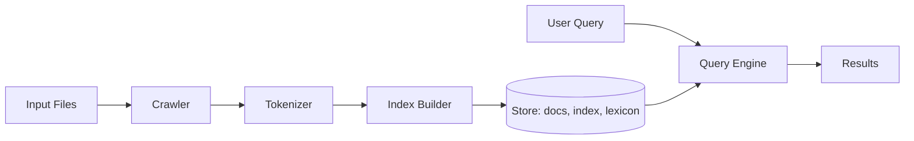

# DevScope

DevScope is a from-scratch search engine and indexer for codebases and logs, built without search libraries. It helps engineers debug and navigate large projects fast.

## Features
- **Custom Document Format**: Optimized binary storage (`docs.bin`, `index.bin`, `lexicon.bin`).
- **Code & Log Awareness**: Specialized tokenization for code identifiers and log timestamps/levels.
- **Search Capabilities**: Boolean operators, metadata filters (e.g. `level:ERROR`, `ext:.py`), and TF-IDF ranking.
- **Performance**: Written in Go for efficiency.

## Architecture



## Usage

### Build
```bash
go build -o devscope ./cmd/devscope
```

### Indexing
Recursively index a directory:
```bash
./devscope index /path/to/project
```
This creates a `.devscope` directory containing the index files.

### Searching
Search the index:
```bash
./devscope search "error AND timeout"
./devscope search "def main ext:.py"
./devscope search "failed level:ERROR"
```

## File Formats
- **docs.bin**: Stores document metadata (ID, Path, Type, Timestamps).
- **lexicon.bin**: Maps terms to their offsets in the inverted index.
- **index.bin**: Stores posting lists (DocID, Frequency, Positions).

## Performance
Designed to handle thousands of files with sub-second query times.
